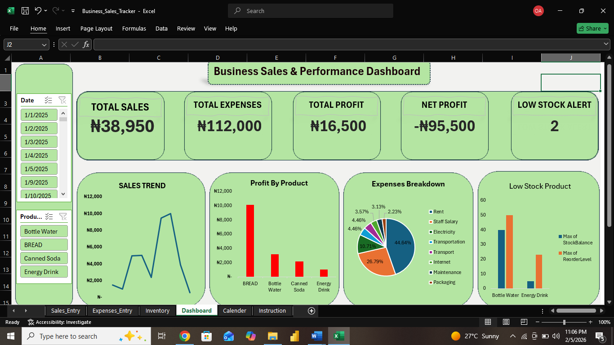

# 📊 Excel Sales Tracker Dashboard (Business-Friendly)

## 📷 Dashboard Preview

## 📌 Project Overview
This project was inspired by a real-world scenario where a small business owner reached out on Twitter asking for help to better understand her sales, profit, expenses, and inventory using **Excel only**.

The goal was to build a **simple, automated, and non-technical sales tracker** that allows business owners to focus on decisions — not formulas or dashboards maintenance.

---

## 🎯 Business Problem
Many small business owners:
- Record sales manually
- Do not clearly know their actual profit
- Cannot track which products perform best
- Run out of stock unexpectedly
- Find tools like Power BI too complex or inaccessible

They need **clarity**, **simplicity**, and **control** — all in one place.

---

## ✅ Solution Summary
An **all-in-one Excel workbook** that includes:

### 📋 Data Entry Sheets
- **Sales Sheet** – daily sales entry
- **Expenses Sheet** – operating expenses
- **Inventory Sheet** – stock levels and reorder points

### ⚙️ Automated Calculations
- Sales, Cost, and Profit calculated automatically
- **Total Profit** = Sales − Cost of Goods Sold
- **Net Profit** = Total Profit − Total Expenses
- **Low Stock Flag** identifies products needing restock

### 📊 Dashboard
A clean, interactive dashboard featuring:

#### KPIs
- Total Sales
- Total Expenses
- Total Profit
- Net Profit
- Low Stock Items

#### Visuals
- Sales Trend (Line Chart)
- Profit by Product (Column Chart)
- Expenses Breakdown (Column Chart)
- Low Stock Alert (Bar Chart)

Includes:
- Date Timeline (Month/Day filtering)
- Product Slicer
- One-click refresh

---

## 🧠 Key Design Decisions
- Used **Excel Tables** for automatic expansion
- Built a **Calendar table** to control time analysis
- Implemented **Data Model relationships** for consistent filtering
- Locked calculated columns to prevent accidental edits
- Hid backend PivotTables for a clean user experience
- Added a **How-to-Use sheet** for non-technical users

---

## 👤 Target Users
- Market women & petty traders
- Pharmacies
- Small retail shops
- Non-technical business owners
- Anyone needing simple business insights without complex tools

---

## 🛠 Tools & Features Used
- Microsoft Excel
- PivotTables & Data Model
- Slicers & Timelines
- Conditional Formatting
- Sheet & Column Protection

---

## 🚀 How to Use
1. Enter data in:
   - Sales sheet
   - Expenses sheet
   - Inventory sheet
2. Click **Data → Refresh All**
3. View insights on the **Dashboard** sheet

No formulas or charts need to be edited.

---

## 📌 Key Takeaway
This project demonstrates that **business-first analytics** does not require complex tools.  
With the right structure and logic, Excel alone can deliver powerful, actionable insights for small businesses.

---
## 📥 Download the Excel File

👉 [Download Excel Sales Tracker](ExcelWorkbook/Business_Sales_Tracker.xlsx)

## 📬 Contact
If you’re interested in:
- Custom dashboards
- Business analytics solutions
- Excel automation for small businesses

Feel free to connect or reach out.

